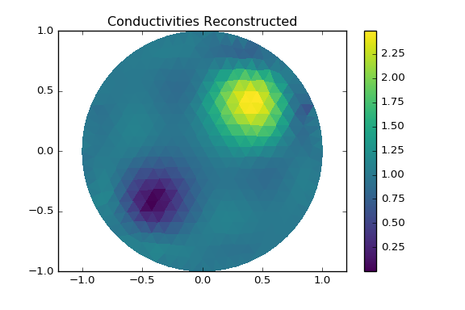

# 

A python-based, open-source package for Electrical Impedance Tomography (EIT)

**Dependencies:**

 - **numpy** (tested with `numpy-1.10.4`, `numpy-1.11.rc1`)
 - **scipy** (tested with `scipy-0.17.0`)
 - **matplotlib** (tested with `matplotlib-1.5.1`)
 - **pandas** (*optional*, tested with `pandas-0.17.1`)
 - **xarray** (*optional*, for long term data analysis)
 - **distmesh** or **meshpy** (both are *optional*), it currently has a build-in distmesh2d module
 - **tetgen** (*optional*) for generating 3D meshes

The distribution, [Anaconda from continuum](https://www.continuum.io/downloads), is suggested to be used with this package.

**Currently suppots:**

 - 2D forward and inverse computing of EIT
 - Reconstruction algorithms : Gauss-Newton solver (JAC), Back-projection (BP), 2D GREIT
 - 2D visualization code

## Demos

### Installation

`pyEIT` is purely python based (in current version), so it can be installed and run without any difficulty.

Option 1, **install global**

```
$ python setup.py build
$ python setup.py install
```

Option 2, **set PYTHONPATH** (recommended)

```
export PYTHONPATH=/path/to/pyEIT
```

In windows, you may set `PYTHONPATH` as a system wide environment. If you are using `spyder-IDE`, or `pyCharm`, you may also set `PYTHONPATH` in the IDE, which is more convenient. Please refer to a specific tool for detailed information.

### Run the demo

Enter the demo folder, pick one demo, and run !

Using `demo/demo_dynamic_bp.py`


Using `demo/demo_dynamic_greit.py`


Using `demo/demo_dynamic_jac.py`


Using `demo/demo_static_jac.py`



## Todos

 - [ ] Generate complex shape using distmesh2d, modify `create` and `pcircle`
 - [ ] Add support for 3D forward and inverse computing
 - [ ] Port iso2mesh to python, and use MRI data as input for 3D mesh generation
 - [ ] More algorithms and data pre-processing modules

## Changelog

 - 0.1, TBD
 - alpha, 2016-03-07
