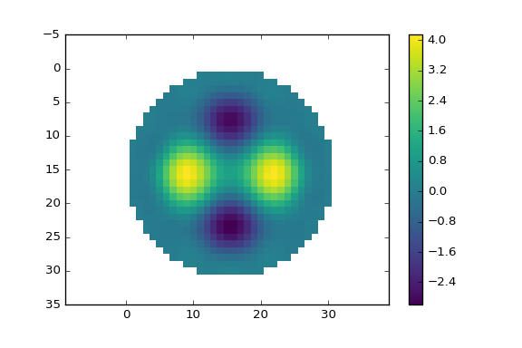
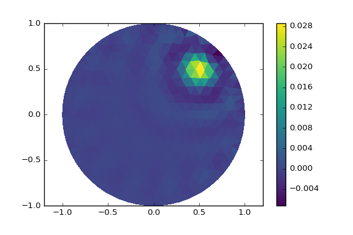

# 

*A python-based, open-source package for Electrical Impedance Tomography (EIT)*

## 1. Introduction

### 1.1 Dependencies

 - **numpy** (tested with `numpy-1.10.4`, `numpy-1.11.rc1`)
 - **scipy** (tested with `scipy-0.17.0`)
 - **matplotlib** (tested with `matplotlib-1.5.1`)
 - **vispy** (tested with `vispy-git`)
 - **pandas** (*optional*, tested with `pandas-0.17.1`)
 - **xarray** (*optional*, for long term data analysis)
 - **distmesh** (*optional*), it currently has a build-in distmesh module (supports 2D and 3D!)
 - **tetgen** (*optional*) for generating 3D meshes

**Note 1, Why vispy ?** `pyEIT` uses `vispy` for visualizing 3D meshes (tetrahedron). `vispy` has minimal system dependencies, all you need is a decent graphical card with `OpenGL` support. It supports fast rendering, which I think is more superior to `vtk` or `mayavi`. Please go to the website [vispy.org](http://vispy.org/) or github repository [vispy.github](https://github.com/vispy/vispy) for more details.

**Note 2, How to contribute ?** The interested user can contribute **(create a PR! any type of improvement is welcome)** forward simulation, inverse solving algorithms as well as their models at current stage. We will setup a wiki page dedicated to this topic.

**Note 3, Fast setup.** [Anaconda from continuum](https://www.continuum.io/downloads) is highly recommended for this package.

### 1.2 Features

 - [x] 2D forward and inverse computing of EIT
 - [x] Reconstruction algorithms : Gauss-Newton solver (JAC), Back-projection (BP), 2D GREIT
 - [x] 2D/3D visualization!

### 1.3 Todo

 - [ ] Generate complex shape using distmesh
 - [ ] Add support for 3D forward and inverse computing
 - [x] 3D mesh generation and visualization
 - [ ] More algorithms and data pre-processing modules
 - [ ] Complete electrode model

## 2. Installation

`pyEIT` is purely python based (in current version), so it can be installed and run without any difficulty.

### 2.1 Install global

```
$ python setup.py build
$ python setup.py install
```

### 2.2 set PYTHONPATH (recommended)

```
export PYTHONPATH=/path/to/pyEIT
```

In windows, you may set `PYTHONPATH` as a system wide environment. If you are using `spyder-IDE`, or `pyCharm`, you may also set `PYTHONPATH` in the IDE, which is more convenient. Please refer to a specific tool for detailed information.

## 3. Run the demo

Enter the demo folder, pick one demo, and run !

### 3.1 (2D) forward and inverse computing

**Using** `demo/demo_dynamic_bp.py`


**Using** `demo/demo_dynamic_greit.py`



**Using** `demo/demo_dynamic_jac.py`



**Using** `demo/demo_static_jac.py`


### 3.2 (3D) forward and inverse computing
